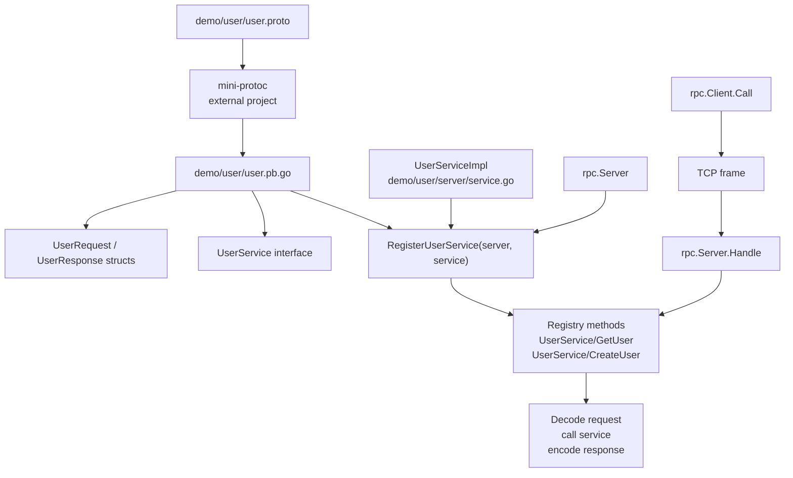
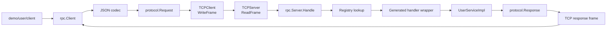

# Mini RPC Current Guide

Mini RPC is now a small TCP-based RPC runtime that can also work with Go code generated by the separate `mini-protoc` project. The runtime owns the network, framing, request/response handling, method registry, and JSON serialization. `mini-protoc` owns schema parsing and generated service glue.

The older README content is intentionally kept below this updated guide for background and learning notes.

## Current Scope

Mini RPC currently provides:

- A public `rpc` package with `Server`, `Client`, `Registry`, and `HandlerFunc`.
- A TCP transport layer in `internal/transport`.
- A length-prefixed protocol layer in `internal/protocol`.
- A JSON codec implementation in `internal/codec`.
- A generated-code demo in `demo/user`.
- Server-side integration with `mini-protoc` generated registration functions.

Generated client types from `mini-protoc` still contain placeholder methods that call `panic("not implemented")`. The working client path today uses `rpc.Client.Call(...)` directly.

## How mini-rpc and mini-protoc Work Together



## Current Project Layout

```text
mini-rpc/
├── rpc/                         Public runtime API
│   ├── client.go                RPC client request/response flow
│   ├── registry.go              Method registry
│   └── server.go                RPC server dispatch and codec helpers
├── internal/
│   ├── codec/                   Codec interface and JSON implementation
│   ├── protocol/                Request/response messages and TCP framing
│   └── transport/               TCP client and server
├── demo/user/
│   ├── user.proto               Schema used by mini-protoc
│   ├── user.pb.go               Generated code from mini-protoc
│   ├── server/                  Demo server implementation
│   └── client/                  Demo client using rpc.Client.Call
├── go.mod
└── README.md
```

## Runtime Architecture



## Quick Start: Run the Demo

Start the server:

```sh
go run ./demo/user/server
```

In another terminal, run the client:

```sh
go run ./demo/user/client
```

The current demo client sends a `UserRequest` to `UserService/GetUser` and prints the decoded `UserResponse`.

## Regenerate demo/user/user.pb.go with mini-protoc

`mini-protoc` lives in a separate project. From this repository, regenerate the demo code with:

```sh
go run github.com/akansha204/mini-protoc/cmd/mini-protoc@latest ./demo/user/user.proto
```

During local development, if `mini-protoc` is checked out beside this repo, you can also run it from that checkout:

```sh
cd ../mini-prtoc
go run ./cmd/mini-protoc ../mini-rpc/demo/user/user.proto
```

The generated file is written next to the proto file:

```text
demo/user/user.proto -> demo/user/user.pb.go
```

## Generated Service Code in the Demo

The generated `demo/user/user.pb.go` contains:

- `UserRequest` and `UserResponse` structs.
- `UserService` interface.
- `UserServiceClient` and `NewUserServiceClient()`.
- Placeholder generated client methods that still panic.
- `RegisterUserService(server *rpc.Server, service UserService)`.

The registration function is the important runtime bridge. It registers method names like `UserService/GetUser`, decodes the request payload using `server.Decode`, calls the concrete `UserService` implementation, and encodes the response using `server.Encode`.

## Server Usage

The demo server creates the runtime server, registers the generated service glue, and starts TCP transport:

```go
jsonCodec := &codec.JSONCodec{}

server := rpc.NewServer(
	jsonCodec,
	rpc.NewRegistry(),
)

user.RegisterUserService(
	server,
	&UserServiceImpl{},
)

tcpServer := transport.NewTCPServer(
	":8080",
	server.Handle,
)

if err := tcpServer.Start(); err != nil {
	log.Fatal(err)
}
```

Your concrete service only needs to implement the generated interface:

```go
type UserServiceImpl struct{}

func (s *UserServiceImpl) GetUser(req user.UserRequest) (user.UserResponse, error) {
	return user.UserResponse{
		Name: req.Name,
		Age:  req.Age,
	}, nil
}
```

## Client Usage

Generated mini-protoc clients are not wired to the runtime yet. Use the runtime client directly:

```go
tcpClient := transport.NewTCPClient(":8080")
if err := tcpClient.Connect(); err != nil {
	log.Fatal(err)
}
defer tcpClient.Close()

client := rpc.NewClient(
	&codec.JSONCodec{},
	tcpClient,
)

req := user.UserRequest{
	Name: "Akansha",
	Age:  21,
}

var resp user.UserResponse

err := client.Call(
	"UserService/GetUser",
	req,
	&resp,
)
if err != nil {
	log.Fatal(err)
}
```

## Request Flow

1. The client encodes the typed request struct into bytes.
2. `rpc.Client` wraps those bytes in a `protocol.Request` with an ID and method name.
3. `transport.TCPClient` writes the request as a length-prefixed TCP frame.
4. `transport.TCPServer` reads the frame and passes it to `rpc.Server.Handle`.
5. `rpc.Server` decodes the request and looks up the method in `Registry`.
6. The generated registration wrapper decodes the payload into the generated request type.
7. Your service implementation runs.
8. The wrapper encodes the typed response.
9. `rpc.Server` wraps it in a `protocol.Response`.
10. The client receives the response and decodes the payload into the result pointer.

## Current Limitations

- Generated mini-protoc client methods are placeholders and do not call the network yet.
- The runtime currently uses JSON serialization.
- Transport is raw TCP with length-prefixed frames.
- There is no timeout, retry, TLS, streaming, service discovery, or connection pooling yet.
- `internal/` packages are intended for use inside this module; external users should prefer the public `rpc` package unless they are working inside this repo.

---

# Mini RPC

A lightweight RPC (Remote Procedure Call) built from scratch in Go. This project teaches you how RPC systems work under the hood by building a complete, working implementation using raw TCP communication.

## What is Mini RPC?

Mini RPC lets you call functions on a remote computer as if they were running locally. Imagine you have a server with a math calculator - Mini RPC allows a client program to ask the server to add two numbers, multiply them, or perform any other registered function, and get the answer back.

Think of it like this:
- **Without RPC**: Your program can only call functions that exist in the same program
- **With RPC**: Your program can call functions on a completely different computer over the network

This project shows exactly how frameworks like gRPC work internally by demonstrating all the moving parts.

## Why Build This?

Understanding RPC systems helps you understand:
- How network communication between programs works
- How data is serialized for transmission over the network
- How message protocols ensure reliable communication
- How services handle thousands of function calls from different clients simultaneously
- The foundation behind popular frameworks like gRPC, JSON-RPC, and others

This is perfect for learning because it strips away all the complexity and shows you the core concepts in their simplest form.

## How It Works (The Big Picture)

Here's the simplest explanation of how Mini RPC works:

1. **Client Side**: You create a request that says "call the Add function with parameters 5 and 3"
2. **Sending**: This request is converted to JSON, wrapped with size information, and sent over a TCP connection
3. **Server Side**: The server reads your request, looks up the Add function, runs it with your parameters
4. **Response**: The server sends back the result (8) as JSON over the same TCP connection
5. **Client Receives**: Your program gets the result and uses it

What makes this work reliably is that we properly structure the messages (so the server knows where one message ends and the next begins), we keep the connection open (so we don't reconnect for every call), and everything is serialized in a standard format (JSON).

## Project Architecture

Mini RPC is built in four layers, each handling a specific responsibility:

```
┌─────────────────────────────────────────────────────────────────┐
│                    Your Application                              │
│              (What you write with Mini RPC)                      │
├─────────────────────────────────────────────────────────────────┤
│                      RPC Layer                                   │
│         Handles request/response logic and routing                │
│    - Client: Sends requests, receives responses                  │
│    - Server: Routes requests to handlers, sends responses        │
│    - Registry: Keeps track of which function handles which call  │
├─────────────────────────────────────────────────────────────────┤
│                   Protocol Layer                                 │
│   Structures messages with clear boundaries (length-prefixing)   │
│             - Encoding/Decoding messages                         │
│             - Serialization (JSON, Protobuf, etc.)               │
├─────────────────────────────────────────────────────────────────┤
│                   Transport Layer                                │
│               Raw TCP socket communication                       │
│              (The actual bytes going over network)                │
└─────────────────────────────────────────────────────────────────┘
```

Each layer does one thing well and builds on the layer below it. This keeps the code clean and easy to understand.

## Project Structure

```
mini-rpc/
├── cmd/                      # Command-line applications
│   ├── client/              # RPC client example
│   │   └── main.go          # Client usage demonstration
│   └── server/              # RPC server example
│       └── main.go          # Server setup and handler registration
│
├── internal/                # Internal packages (not exported)
│   ├── codec/               # Serialization/deserialization
│   │   ├── codec.go         # Codec interface definition
│   │   └── json_codec.go    # JSON-based implementation
│   │
│   ├── protocol/            # RPC protocol definitions
│   │   ├── framing.go       # TCP frame serialization
│   │   └── messaging.go     # Request/Response message structures
│   │
│   ├── rpc/                 # RPC core logic
│   │   ├── client.go        # RPC client implementation
│   │   ├── server.go        # RPC server implementation
│   │   ├── registry.go      # Method registry for dispatching
│   │   └── handler.go       # Example method handlers (Calculator)
│   │
│   └── transport/           # Network communication
│       ├── tcp_client.go    # TCP client connection handler
│       └── tcp_server.go    # TCP server listener and handler
│
├── go.mod                   # Go module definition
└── README.md               
```

## Component Details

### 1. Transport Layer (`internal/transport/`)

The transport layer manages all network communication using TCP sockets.

**TCPServer** (`tcp_server.go`):
- Listens on a specified address (e.g., `:8080`)
- Accepts incoming client connections
- Handles each connection concurrently using goroutines
- Forwards incoming data to a handler function

**TCPClient** (`tcp_client.go`):
- Connects to a remote RPC server
- Sends serialized messages to the server
- Uses the protocol layer for frame-based communication

### 2. Protocol Layer (`internal/protocol/`)

Defines how RPC messages are structured and transmitted over the network.

**Messaging** (`messaging.go`):
- **Request**: Contains method name, parameters, and request ID
  ```go
  type Request struct {
      ID     uint64        // Unique request identifier
      Method string        // Method name to invoke
      Params []interface{} // Method parameters
  }
  ```
- **Response**: Contains result, error, and corresponding request ID
  ```go
  type Response struct {
      ID     uint64      // Matches request ID
      Result interface{} // Method result
      Error  string      // Error message if any
  }
  ```

**Framing** (`framing.go`):
- Implements TCP frame serialization using a length-prefixed protocol
- Ensures reliable message boundaries over TCP stream
- Header: 4-byte big-endian integer representing payload length
- Max frame size: 4MB (prevents unbounded memory allocation)
- Functions: `WriteFrame()` sends data, `ReadFrame()` receives data

### 3. Codec Layer (`internal/codec/`)

Handles serialization and deserialization of data for network transmission.

**Codec Interface** (`codec.go`):
```go
type Codec interface {
    Encode(v interface{}) ([]byte, error)  // Serialize to bytes
    Decode(data []byte, v interface{}) error // Deserialize from bytes
}
```

**JSONCodec** (`json_codec.go`):
- Default implementation using JSON serialization
- Easy to debug (human-readable format)
- Can be extended to support other formats (Protobuf, MessagePack, etc.)

### 4. RPC Core Layer (`internal/rpc/`)

Implements the actual RPC client and server logic.

**Registry** (`registry.go`):
- Maintains a map of method names to handler functions
- Allows registration of custom methods: `registry.Register("MethodName", handlerFunc)`
- Provides lookup: `registry.Get("MethodName")` returns the handler

**Server** (`server.go`):
- Core RPC server logic that processes incoming requests
- Receives serialized request data
- Decodes request, looks up method in registry
- Executes the handler with provided parameters
- Encodes and returns response
- Handles errors gracefully with error messages in response

**Client** (`client.go`):
- Core RPC client logic for making remote calls
- Maintains connection to server via TCPClient
- `Call(method string, params []interface{}, result interface{})` executes remote method
- Encodes request, sends it, waits for and decodes response
- Returns result or error

**Handlers** (`handler.go`):
- Example implementation: Calculator with Add, Subtract, Mul, Div methods
- Shows how to implement handler functions matching `HandlerFunc` signature
- Error handling inside handler returns to client

## Getting Started

### Prerequisites

- Go 1.25.3 or higher
- TCP port 8080 available (configurable in examples)

### Installation

Clone the repository:
```bash
git clone https://github.com/akansha204/mini-rpc.git
cd mini-rpc
```

Build the project:
```bash
go build ./cmd/server
go build ./cmd/client
```

### Quick Start: Running the Example

Terminal 1 - Start the server:
```bash
go run ./cmd/server
```

Expected output:
```
mini-rpc Server Starting...
Server listening on :8080
```

Terminal 2 - Run the client:
```bash
go run ./cmd/client
```

Expected output:
```
Result 8        # Add(5, 3) = 8
Result 2        # Subtract(5, 3) = 2
Result 15       # Mul(5, 3) = 15
Result 1        # Div(5, 5) = 1
```

## How to Use: Building Your Own RPC Service

### Step 1: Define Your Methods

Create handler functions that match the `HandlerFunc` signature:
```go
type HandlerFunc func(params []interface{}) (interface{}, error)
```

Example: Create a greeter service
```go
type Greeter struct{}

func (g *Greeter) Hello(params []interface{}) (interface{}, error) {
    if len(params) != 1 {
        return nil, fmt.Errorf("Hello expects 1 parameter")
    }
    name := params[0].(string)
    return "Hello, " + name + "!", nil
}
```

### Step 2: Register Methods

Instantiate registry and register handlers:
```go
registry := rpc.NewRegistry()
greeter := &Greeter{}
registry.Register("Hello", greeter.Hello)
```

### Step 3: Create and Start Server

```go
jsonCodec := &codec.JSONCodec{}
rpcServer := rpc.NewServer(jsonCodec, registry)
tcpServer := transport.NewTCPServer(":8080", rpcServer.Handle)

if err := tcpServer.Start(); err != nil {
    log.Fatal(err)
}
```

### Step 4: Client-Side Usage

```go
// Connect to server
client := transport.NewTCPClient(":8080")
if err := client.Connect(); err != nil {
    log.Fatal(err)
}
defer client.Close()

// Create RPC client
jsonCodec := &codec.JSONCodec{}
rpcClient := rpc.NewClient(jsonCodec, client)

// Call remote method
var result string
err := rpcClient.Call("Hello", []interface{}{"World"}, &result)
if err != nil {
    log.Fatal(err)
}
fmt.Println(result) // Output: Hello, World!
```

## Protocol Details

### Request Flow

1. **Client** creates `Request` with unique ID, method name, and parameters
2. **Client** encodes request using codec to bytes
3. **Client** frames the serialized bytes (4-byte length prefix)
4. **Client** sends frame over TCP
5. **Server** reads frame, extracting length and payload
6. **Server** decodes payload to `Request` object
7. **Server** looks up method in registry
8. **Server** executes handler function with parameters
9. **Server** creates `Response` with result or error
10. **Server** encodes and frames response
11. **Server** sends response back over TCP
12. **Client** reads and parses response
13. **Client** returns result or error to caller

### Message Format

**TCP Frame Format:**
```
┌─────────────┬──────────────┐
│   Header    │   Payload    │
│  (4 bytes)  │  (Variable)  │
├─────────────┼──────────────┤
│   Length    │  JSON Data   │
│  (uint32)   │              │
└─────────────┴──────────────┘
```

**Request JSON:**
```json
{
  "id": 1,
  "method": "Add",
  "params": [5, 3]
}
```

**Response JSON:**
```json
{
  "id": 1,
  "result": 8,
  "error": ""
}
```

## Key Design Patterns

### Interface-Based Design
- `Codec` interface allows pluggable serialization
- Easy to add new codecs without changing core logic

### Registry Pattern
- Methods registered dynamically at runtime
- Flexible service composition

### Concurrent Connection Handling
- Each client connection handled in separate goroutine
- Scales to multiple simultaneous clients

### Error Handling
- Errors captured in Response message
- Client receives error details from server
- No exception-based error propagation

## Dependencies

The project uses only Go standard library modules:
- `encoding/json` - JSON codec
- `encoding/binary` - Frame header serialization
- `net` - TCP networking
- `fmt`, `log`, `io` - Utilities

No external dependencies required, keeping the project lightweight and dependency-free.

## Performance Considerations

- **Sequential Request-Response**: Current implementation sends request and waits for response. For high throughput, implement request pipelining.
- **Connection Pooling**: Extend `TCPClient` to support connection reuse and pooling.
- **Message Batching**: Combine multiple RPC calls in one request for reduced latency.
- **Codec Performance**: JSON is convenient but slower than binary formats like Protobuf or MessagePack.

## Future Enhancements

- Asynchronous request handling with callbacks
- Request timeout and retry logic
- Service discovery and load balancing
- HTTP/2 or gRPC integration
- TLS support for secure communication
- Streaming RPC support
- Metrics and monitoring

## License

MIT

## Contributing

This is an educational project. Feel free to fork and experiment with enhancements!
